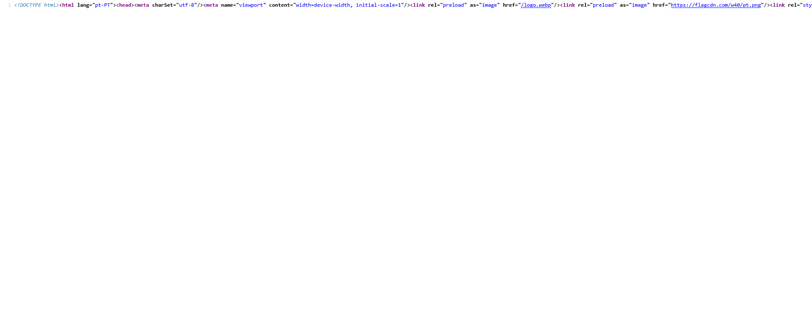

meter login com Google

https://www.matchworky.com/en/plans melhorar pagina de plans 

no registo acho que deves meter no e sobrenome
facilipa depois
uma depois escrevem o nome todo, sem necessidade
tenho q meter para ele verificar o email tbm como uso para entrar na vaga 

corrir bugs de convites onde o suer ja acetou e ainda esta pedente!

tens que ver porque é que o ctr+U isto não com linhas

no tipop tens que meter mais "Regime independete". o contexto tem que ser um campo de texto maior. qdo seleciona Experiencia desejada devia abrir um campo para escrever algo

tens que fazer o tal menu provisório "consumos" para irmos vendo o que consome de tokens
aqui devias ter um preview com o link para a entrevista. e um botao para enviar por email candidato

depois dou a ai um contexto de x img e digo a ele para escolher a melhor 
 
posso tentar fazer isso
 

 pagina de super admin so para ver o consumo de tokens 

 criar dados de aceso para contas do cpanel esqueci dos ddos!